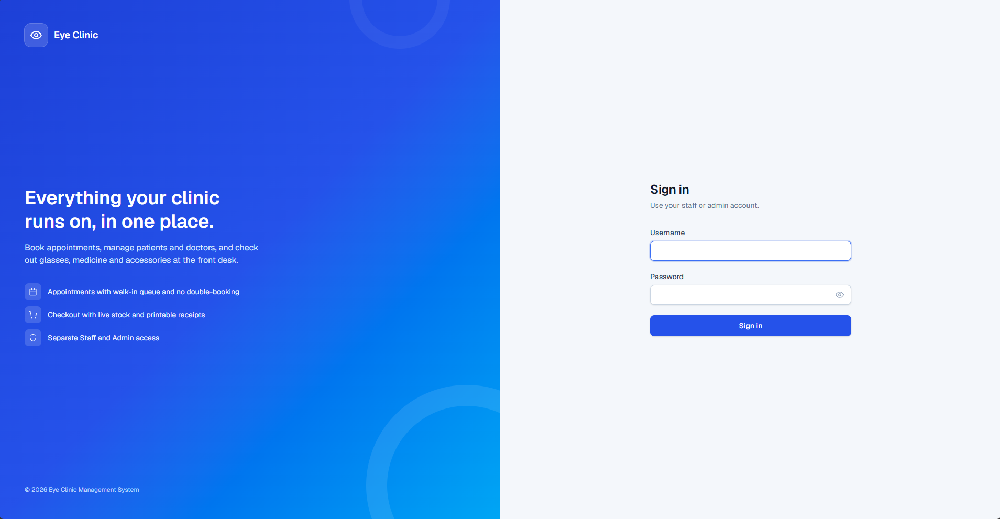
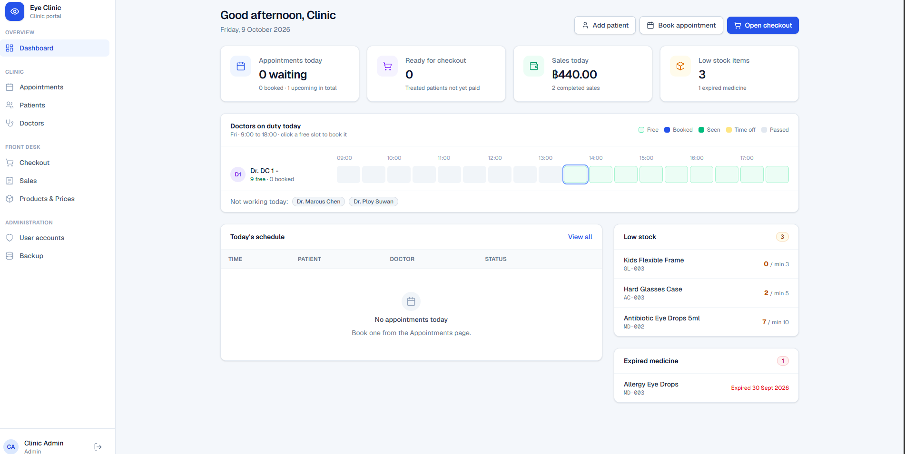
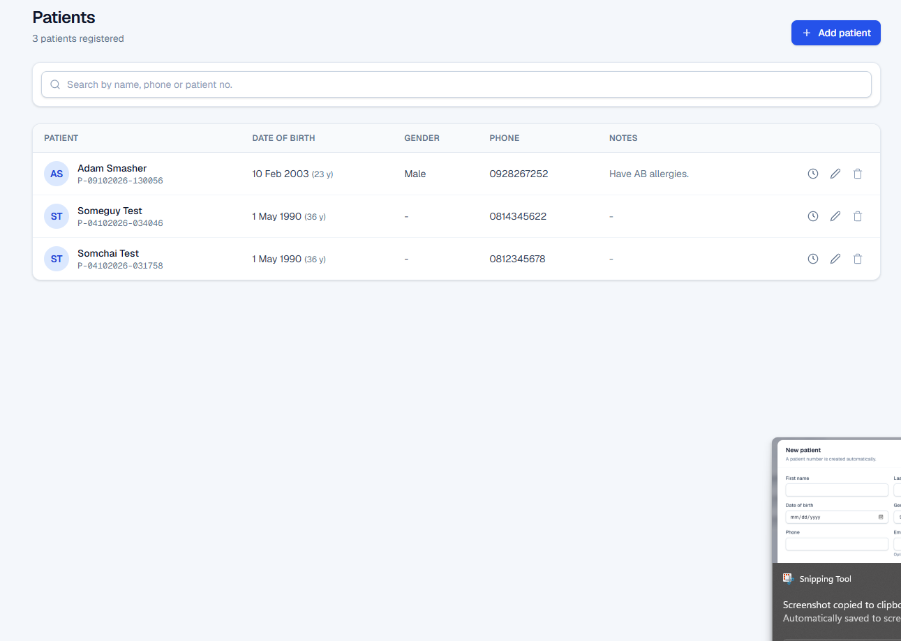
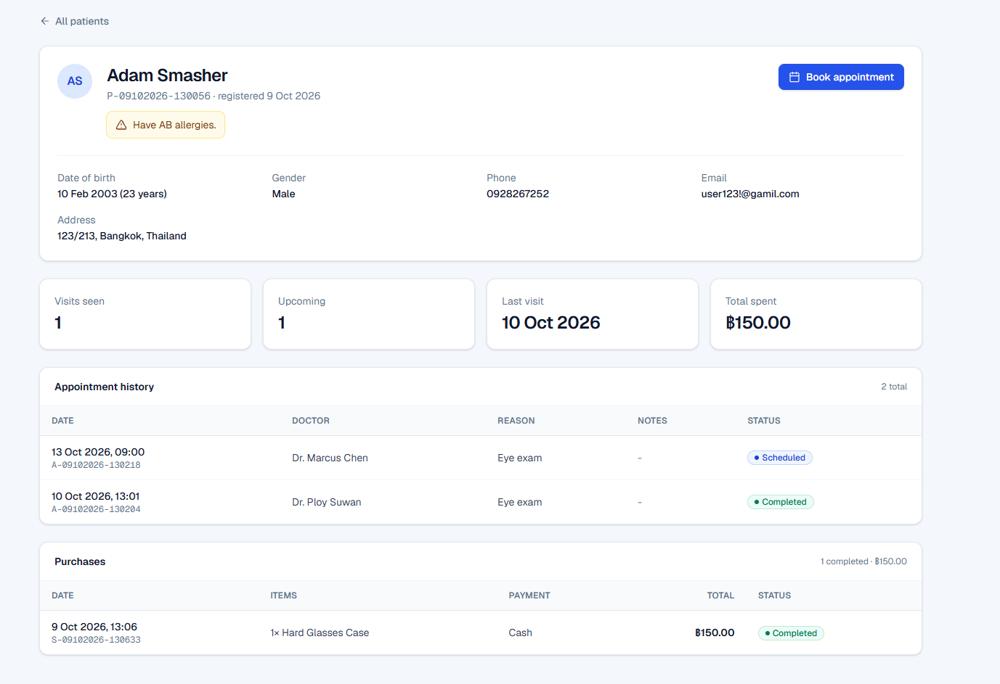
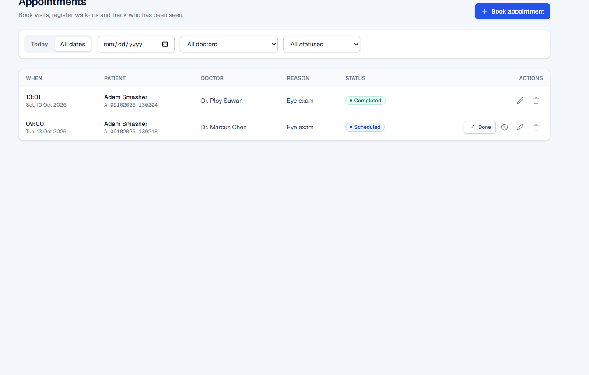
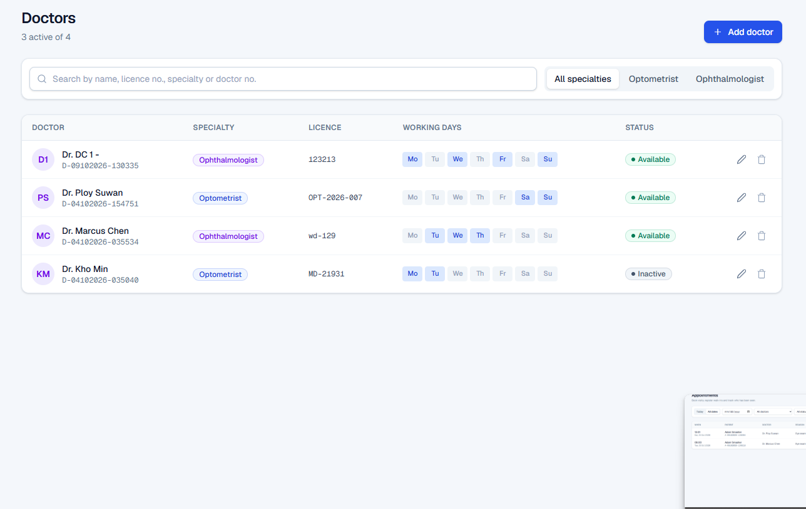
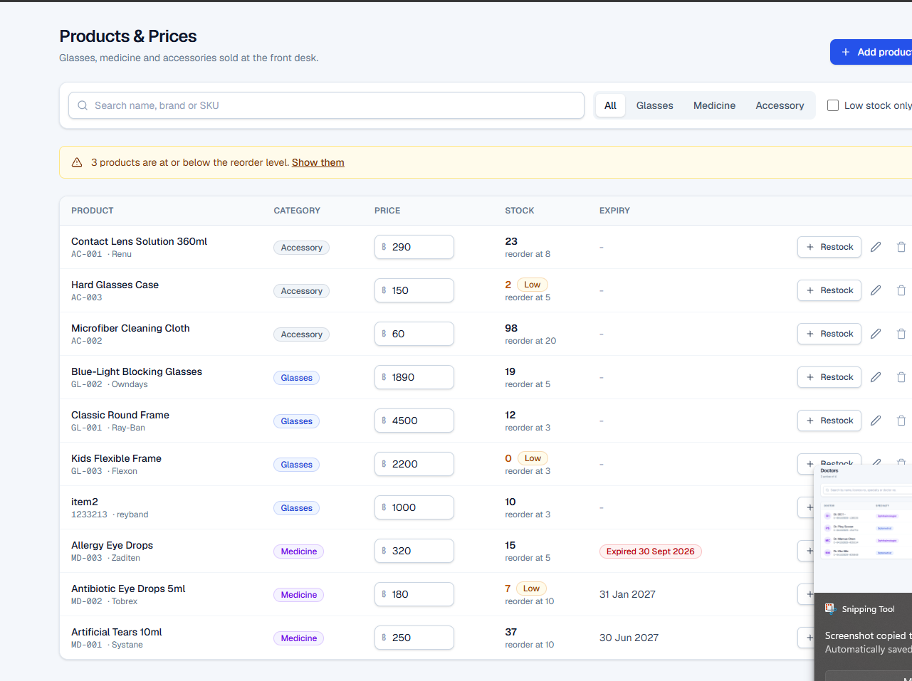
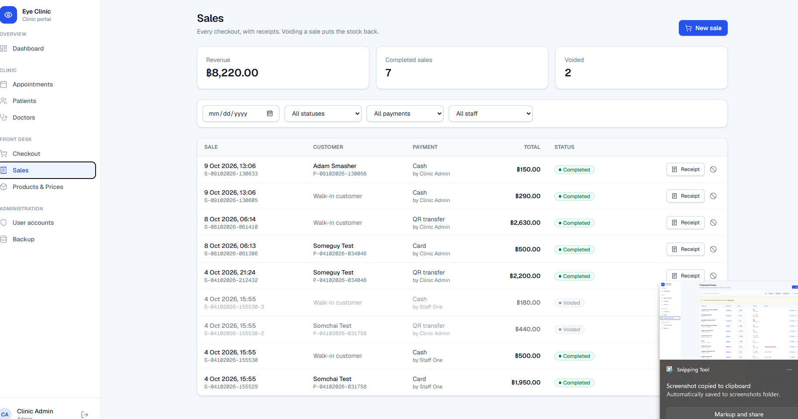
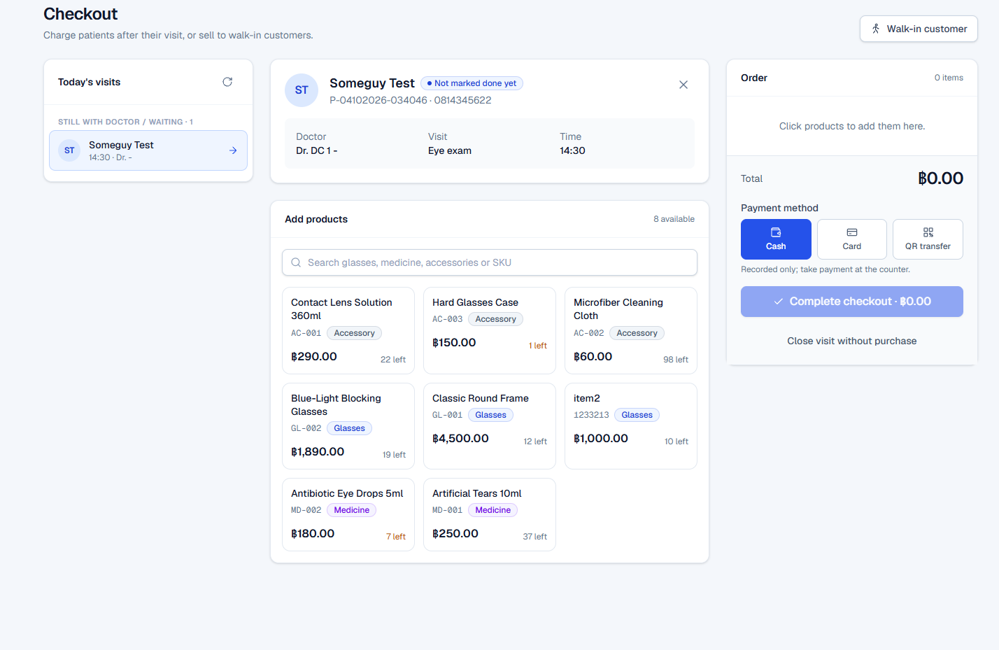
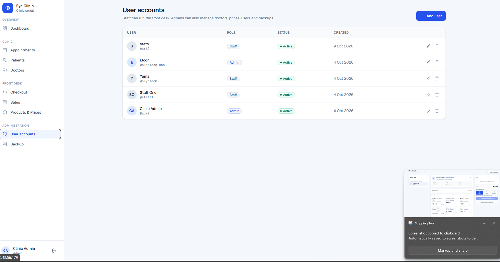

# Eye Clinic Management System

A web portal for a small eye clinic. Front-desk staff register patients, book appointments with doctors, check patients out and sell glasses, medicine and accessories. Admins also manage doctors, product prices, user accounts and backups.

Built for **Project 02: Full-Stack CRUD App**.

| | |
|---|---|
| **Live site** | http://20.48.56.179 |
| **Repository** | https://github.com/DeceptThat/eye_clinic_web |
| **Video demo** | https://youtu.be/WzKqDErOsfs?si=z1DT-ddfE9PA9U8q|

## Team members

- Khon Min Wai Than
- Yan Naing Lin Aung

## Screenshots

| Login | Dashboard |
|---|---|
|  |  |

| Patients | Patient detail |
|---|---|
|  |  |

| Appointments | Doctors |
|---|---|
|  |  |

| Products | Sales |
|---|---|
|  |  |

| Checkout | Users |
|---|---|
|  |  |

## Features

### Patients (Staff, Admin)
- Create, view, edit and delete patients. Each one gets a record number such as `P-04102026-031105` that never changes.
- Search by number, name or phone.
- Patient detail page with appointment history, purchases, total spent and a shortcut to book or check out.
- A patient with upcoming appointments cannot be deleted.

### Doctors (Admin manages, Staff views)
- Create, view, edit and delete doctors: specialty (Optometrist / Ophthalmologist), licence number, working days, active or inactive.
- Time off (leave, sick, emergency surgery), which blocks bookings in that period.
- A doctor with upcoming appointments cannot be deleted.

### Appointments (Staff, Admin)
- Create, view, edit, cancel, complete and delete appointments in 30-minute slots.
- Booking rules checked on the server:
  - no booking in the past
  - only on the doctor's working days
  - not during time off
  - no double booking for the doctor or the patient
- **Next free** finds the earliest open slot in the next 2 weeks. **Walk-in** adds the patient to the end of today's queue.
- Filter by date, doctor and status.

### Products / inventory (Admin manages, Staff views)
- Create, view, edit and delete glasses, medicine and accessories: SKU, brand, price, stock and reorder level.
- Low-stock filter and warnings. Medicine has an expiry date, and expired items cannot be sold.
- Stock only changes through **Restock** or a sale, never by editing the number directly.

### Sales (Staff, Admin)
- Create sales with several items. Stock is taken atomically, so two sales cannot oversell.
- The price is copied at the time of sale, so old receipts stay correct after a price change.
- **Void** returns the stock. Only a voided sale can be deleted (Admin).
- Filter by date, payment method, patient and seller.

### Checkout
- Today's queue of visits that haven't paid yet.
- Sell items for the visit, or close it without a purchase. Either way the appointment is marked as completed.

### Dashboard
- Today's numbers, upcoming appointments and low-stock alerts.
- **Doctors on duty today**: a timeline of every 30-minute slot (free, booked, seen, time off). Click a free slot to book it.
- Quick buttons: **Add patient**, **Book appointment**.

### Users and security
- Two roles: **Staff** (front desk) and **Admin** (also doctors, products, users, backup).
- Passwords are hashed with bcrypt. Login uses a signed JWT in an httpOnly cookie.
- You are logged out after 30 minutes without activity, 8 hours after login, or when the browser closes.
- Every API route checks the role on the server, not just the menu.

### Backup (Admin)
- **Download backup**: one JSON file with all collections. Users are exported without password hashes.
- The server makes a full `mongodump` every night at 02:00 (Thailand time) and keeps the last 7 days. The Backup page shows the latest one.

## Tech stack

| Layer | Technology |
|---|---|
| Frontend | Next.js 16 (App Router), React 19, Tailwind CSS 4 |
| Backend | Next.js route handlers (REST API) |
| Database | MongoDB 8 with Mongoose 9 |
| Auth | JWT (`jose`) in an httpOnly cookie, `bcryptjs` |
| Hosting | Azure VM (Ubuntu 24.04), PM2, Nginx reverse proxy, MongoDB on the same VM |

The app runs as a long-lived Node.js server on a virtual machine. It is not serverless and does not use Firebase or any managed backend.

## Data models

| Model | Main fields |
|---|---|
| Patient | patientNo, firstName, lastName, dateOfBirth, gender, phone, email, address, medicalNotes |
| Doctor | doctorNo, firstName, lastName, specialty, licenseNo, phone, email, workingDays, isActive, timeOff[] |
| Appointment | appointmentNo, patient → Patient, doctor → Doctor, dateTime, reason, status, notes, checkedOutAt |
| Product | name, brand, category, sku, price, stockQty, reorderLevel, expiryDate, isActive |
| Sale | saleNo, patient → Patient, appointment → Appointment, items[], total, paymentMethod, soldBy → User, status |
| User | name, username, passwordHash, role, isActive |

## REST API

All routes are under `/api` and need a logged-in user. Routes marked **Admin** reject Staff with `403`.

| Resource | Endpoints |
|---|---|
| Auth | `POST /auth/login`, `POST /auth/logout`, `GET /auth/me` |
| Patients | `GET /patients?q=`, `POST /patients`, `GET / PUT / DELETE /patients/:id` |
| Doctors | `GET /doctors?q=&specialty=`, `GET /doctors/:id`; Admin: `POST /doctors`, `PUT / DELETE /doctors/:id` |
| Appointments | `GET /appointments?date=&doctor=&patient=&status=`, `POST /appointments`, `GET / PUT / DELETE /appointments/:id`, `GET /appointments/next-slot?doctor=&walkin=1` |
| Products | `GET /products?q=&category=&lowStock=1`, `GET /products/:id`; Admin: `POST /products`, `PUT / DELETE /products/:id` (`PUT { restock: n }` adds stock) |
| Sales | `GET /sales?date=&status=&paymentMethod=&patient=&soldBy=`, `POST /sales`, `GET /sales/:id`, `PUT /sales/:id { status: "Voided" }`; Admin: `DELETE /sales/:id`; `GET /sales/sellers` |
| Checkout | `GET /checkout` (today's visits waiting for checkout) |
| Dashboard | `GET /dashboard` |
| Users (Admin) | `GET /users`, `POST /users`, `PUT / DELETE /users/:id` |
| Backup (Admin) | `GET /backup` (JSON download), `GET /backup/status` |

Bad input returns `400` with a readable message, a missing record returns `404`, and a rule conflict (such as a double booking or not enough stock) returns `409`.

## Run locally

Requirements: Node.js 20+ and a MongoDB database (local or Atlas).

1. Install packages:
   ```bash
   npm install
   ```
2. Create `.env.local` in the project root. It is not committed:
   ```env
   MONGODB_URI=mongodb://127.0.0.1:27017/eyeclinic
   JWT_SECRET=any-long-random-string
   # optional, only on the server: folder the nightly backups go to
   BACKUP_DIR=/home/<user>/backups
   ```
3. Create the first admin account:
   ```bash
   node --env-file=.env.local scripts/create-admin.mjs
   ```
   This creates the user `admin` with the starting password printed in the terminal. Log in and change it on the **Users** page straight away.
4. Start the app:
   ```bash
   npm run dev
   ```
   Open http://localhost:3000.

## Deployment (Azure VM)

The live site runs on an Ubuntu 24.04 VM:

- **MongoDB 8** runs locally on the VM, bound to `127.0.0.1` only.
- **PM2** runs the app (`next start` on port 3000) and restarts it after a reboot (`pm2 startup`, `pm2 save`).
- **Nginx** listens on port 80 and forwards requests to `127.0.0.1:3000`.

Update the live site after pushing to GitHub:

```bash
cd ~/eyeclinic && git pull && npm ci && npm run build && pm2 restart eyeclinic
```

Nightly backup (`crontab -e` on the VM; the VM clock is UTC, so 19:00 UTC is 02:00 in Thailand):

```cron
0 19 * * * mongodump --quiet --db eyeclinic --out /home/adminElcon/backups/$(TZ=Asia/Bangkok date +\%F) && find /home/adminElcon/backups -mindepth 1 -maxdepth 1 -type d -mtime +7 -exec rm -rf {} +
```

## Project structure

```
src/
  app/            pages (dashboard, patients, doctors, appointments, products, sales, checkout, users, backup, login)
  app/api/        REST API route handlers
  components/     AppShell (sidebar), DutyBoard, shared UI
  lib/            db connection, auth, booking rules, validation and error helpers
  models/         Mongoose models
  proxy.js        redirects to /login when not logged in; admin-only pages
scripts/
  create-admin.mjs
```
